##KY-016 RGB 5mm LED / KY-009 RGB LED SMD 

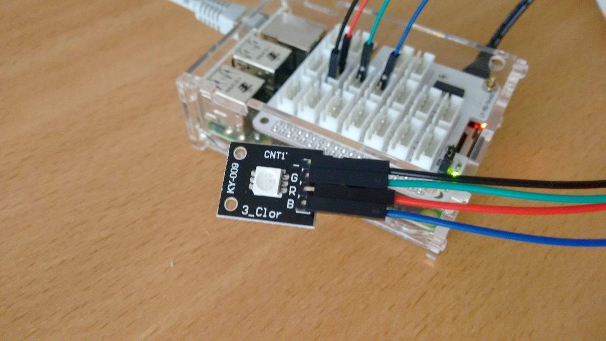

Example code [here](rgb.py)

### Code Colors
Based on the raspberry code of [sensorkit.joy-it.net](http://sensorkit.joy-it.net/index.php?title=KY-016_RGB_5mm_LED_Modul)

. |. | .
------------ | ------------- | -------
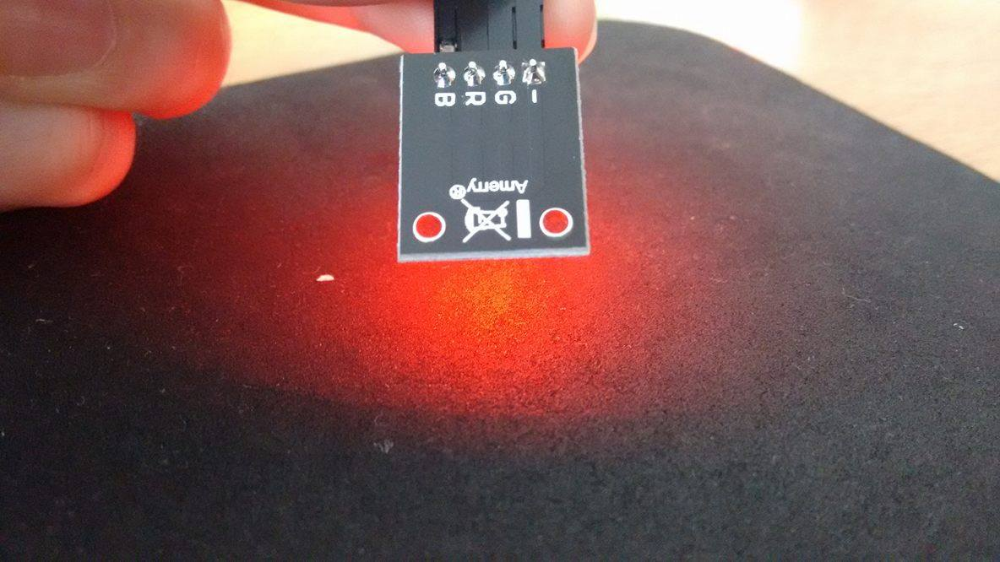 | 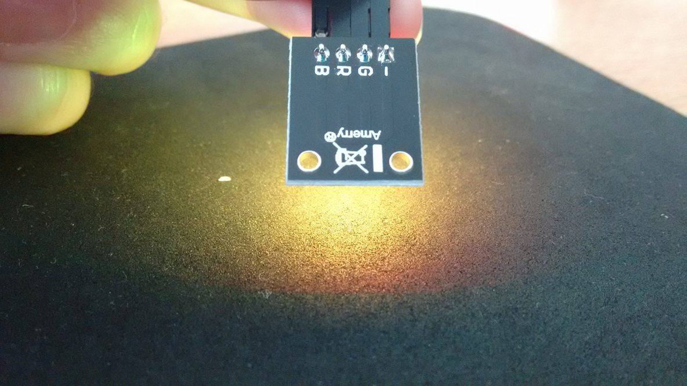 | 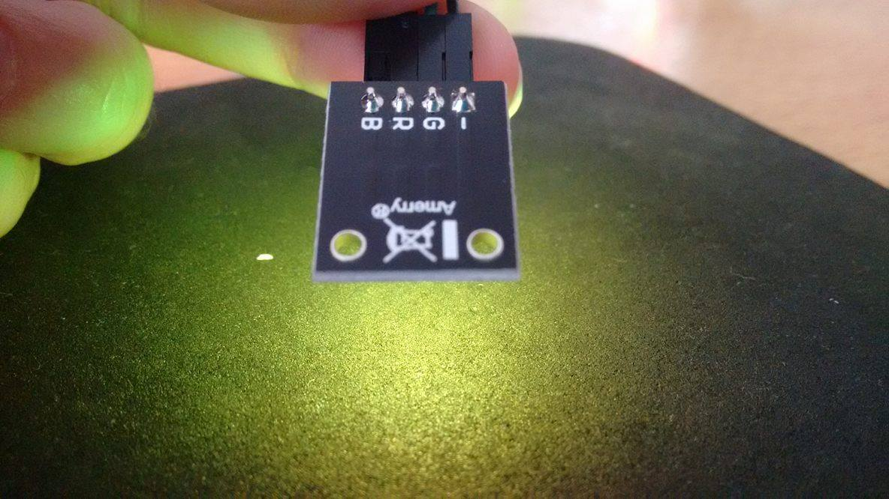
LED_Farbe(100,0,0,1) - **RED**  |    LED_Farbe(100,50,0,1) - **ORANGE**  |  LED_Farbe(100,100,0,1) - **YELLOW**
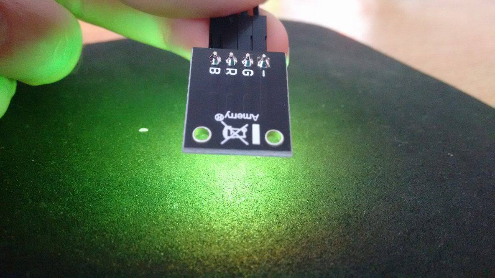 | 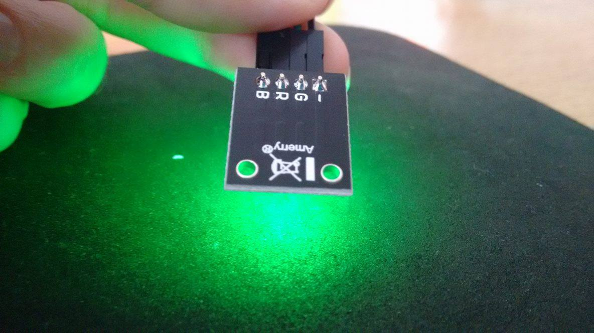 | 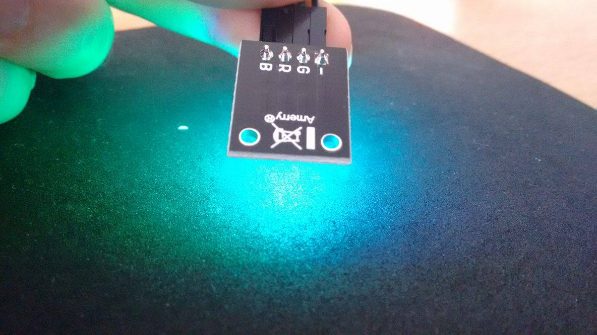
LED_Farbe(50,100,0,1) - **LIGHT GREEN**  |    LED_Farbe(0,100,0,1) - **GREEN**  |  LED_Farbe(0,100,50,1) - **AQUA**
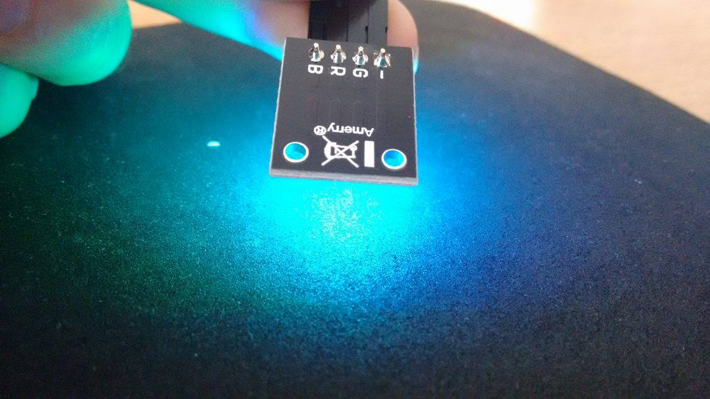 | 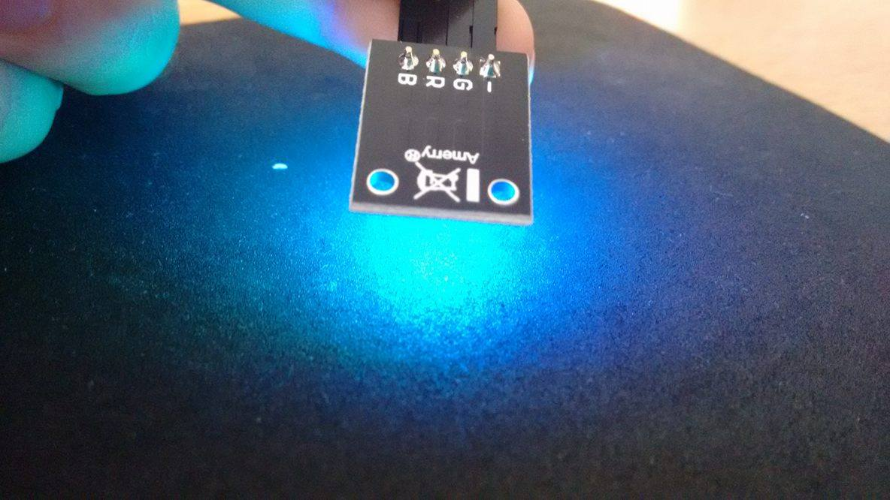 | 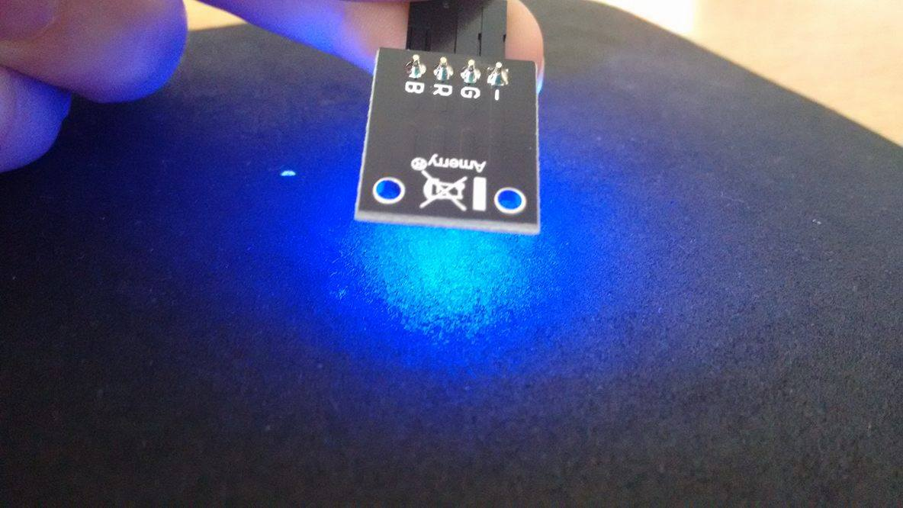
LED_Farbe(0,100,100,1) - **CYAN**  |    LED_Farbe(0,50,100,1) - **LIGHT BLUE**  |  LED_Farbe(0,0,100,1) - **BLUE**
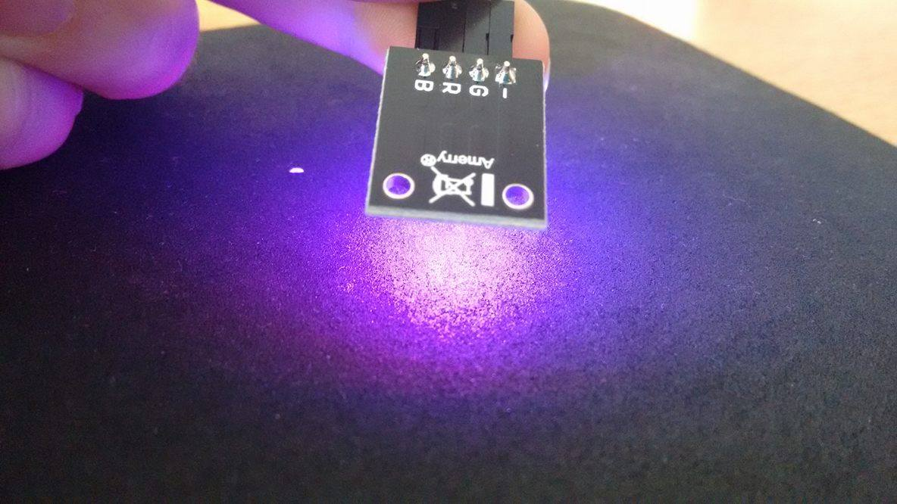| 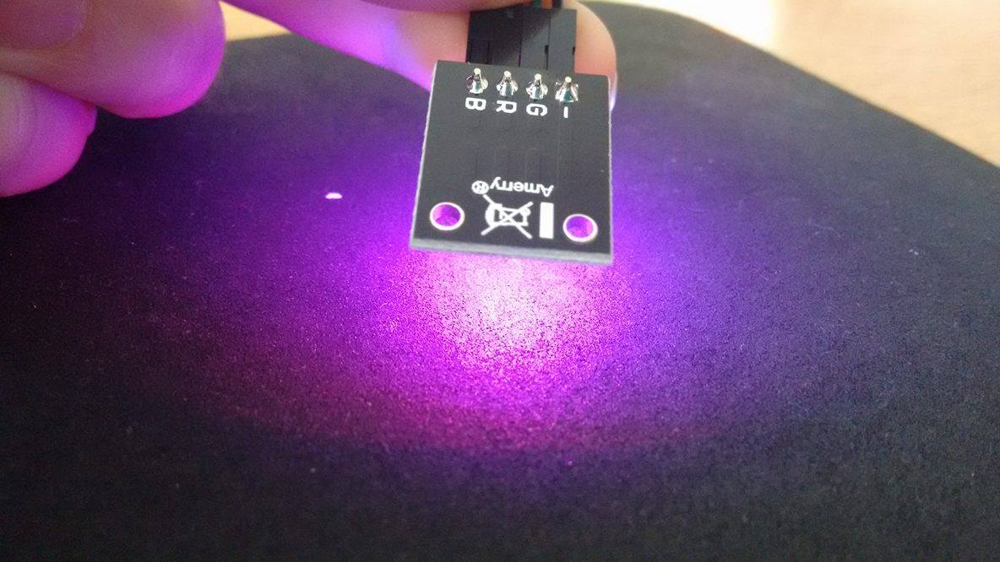 | 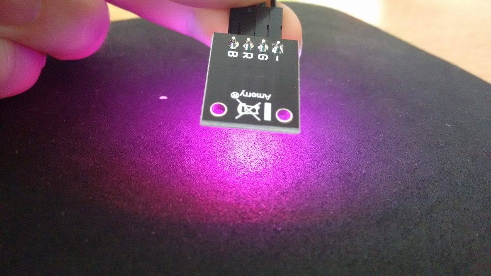
LED_Farbe(50,0,100,1) - **PURPLE**  |    LED_Farbe(100,0,100,1) - **MAGENTA**  |  LED_Farbe(100,0,50,1) - **PINK**

##Linker-Kit RGB Led

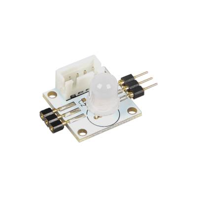

* RGB
* 8mm
* Chipset WS2812
* Working voltage: 3 V  ~  5 V

## get it running

Connect the RGB led on pin 12:

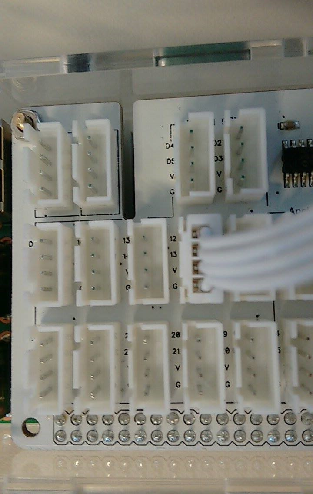

Then:

    git clone https://github.com/jgarff/rpi_ws281x.git
    cd rpi_ws281x.git
    sudo apt-get install scons swig
    sudo scons
    cd python
    sudo python ez_setup.py
    sudo python setup.py install
    
    cd examples
    python strandtest.py

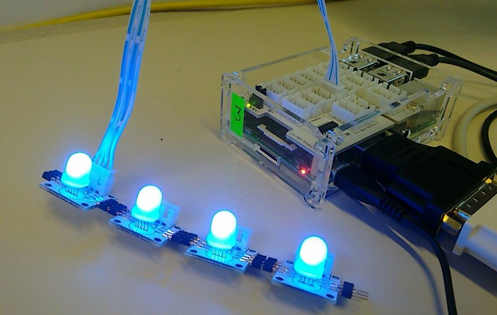
