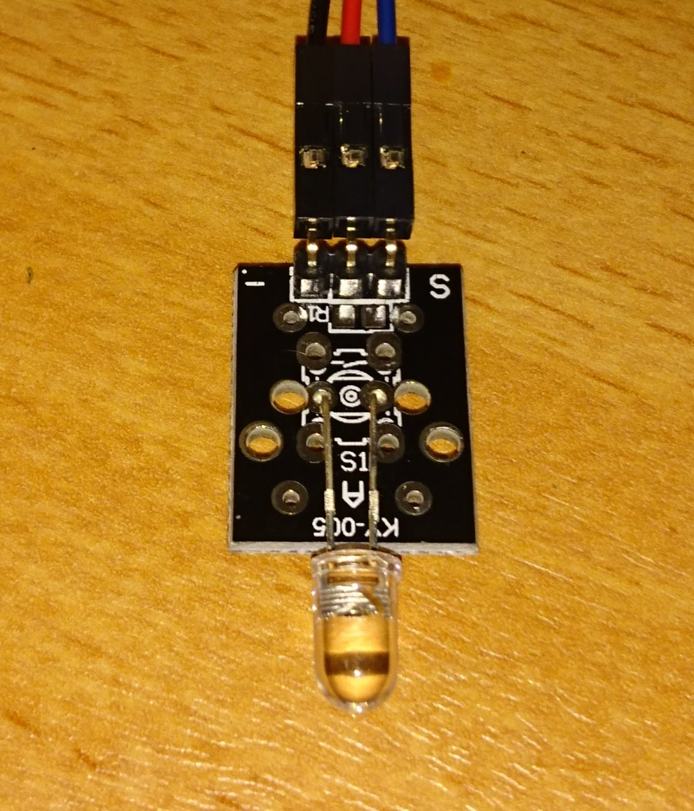

## Actor KY-005: Infrared Transmitter

This actor was tested together with the [sensor infrared receiver](../sensor-infrared-receiver).

The pins for the extension board, where (`sensor: board`) - following the [example code](infrared-send.py):
* -:	G
* (middle pin):	V
* S:	D16
