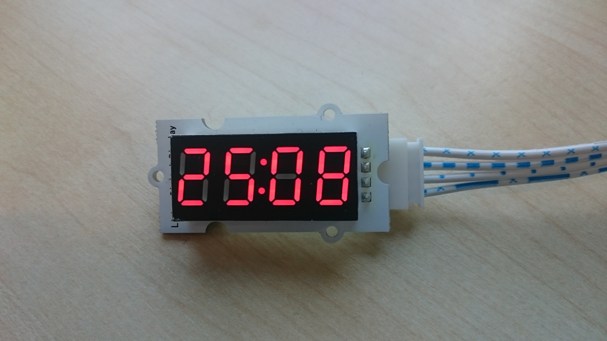
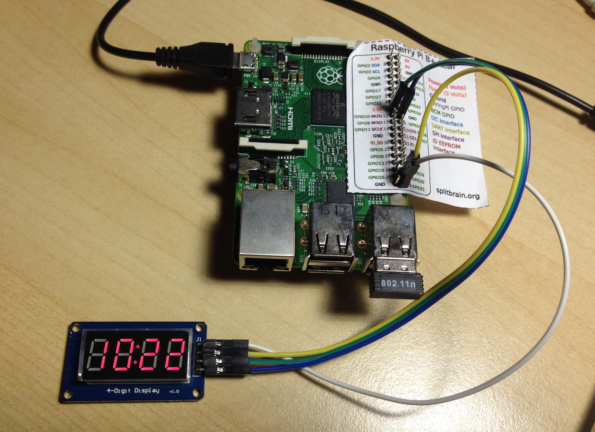

tm1637.py is a driver library; display.py, displayIP.py, and clock.py all show its use

###Pins connection

    | Board Pin | Name | Remarks     | RPi Pin | RPi Function      |
    |----------:|:-----|:------------|--------:|-------------------|
    | 1         | GND  | Ground      | 2       | 5V0               |
    | 2         | VCC  | +5V Power   | 6       | GND               |
    | 3         | DIN  | Data In     | 38      | GPIO 20           |
    | 4         | CLK  | Clock       | 40      | GPIO 21           |

<!-- Display purchased from: http://www.resistorpark.com/4-digit-7-segment-led-display/ -->

*Note: Most GPIO pins will work in place of the above pins (Such as DIN - GPIO 24 & CLK- GPIO 23)*
