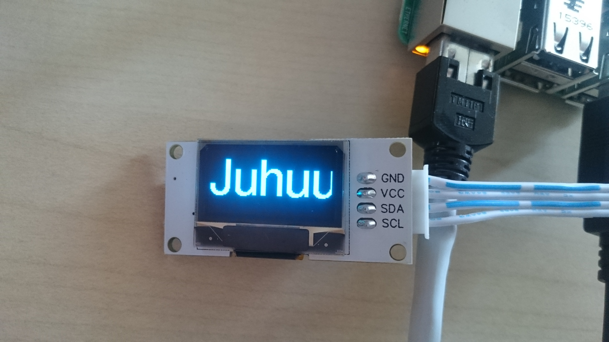

linksprite OLED board

* 128x64 pixel
* Communication interface: IIC
* Driver IC: SSD1306
* Working voltage: 3.3 V  ~  5.5 V
* Working temperature: – 30 ℃ ~ 70 ℃
* Display color: mono color (blue)

## get it running

use "raspi-config" to enable I2C interface

    git clone https://github.com/adafruit/Adafruit_Python_SSD1306.git
    cd Adafruit_Python_SSD1306
    sudo python setup.py install
    sudo apt-get install build-essential libi2c-dev i2c-tools python-dev libffi-dev
    sudo pip install smbus-cffi
    
    cd examples
    python image.py

