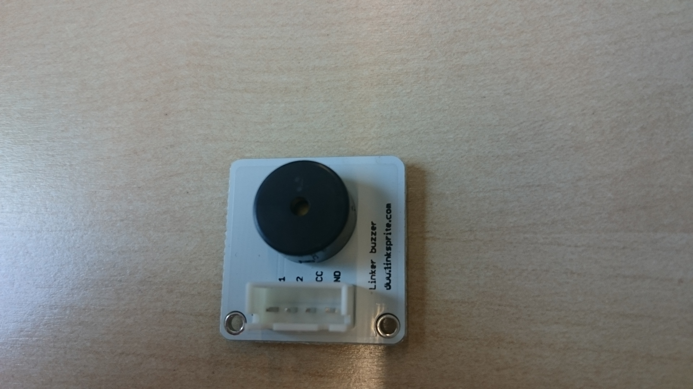
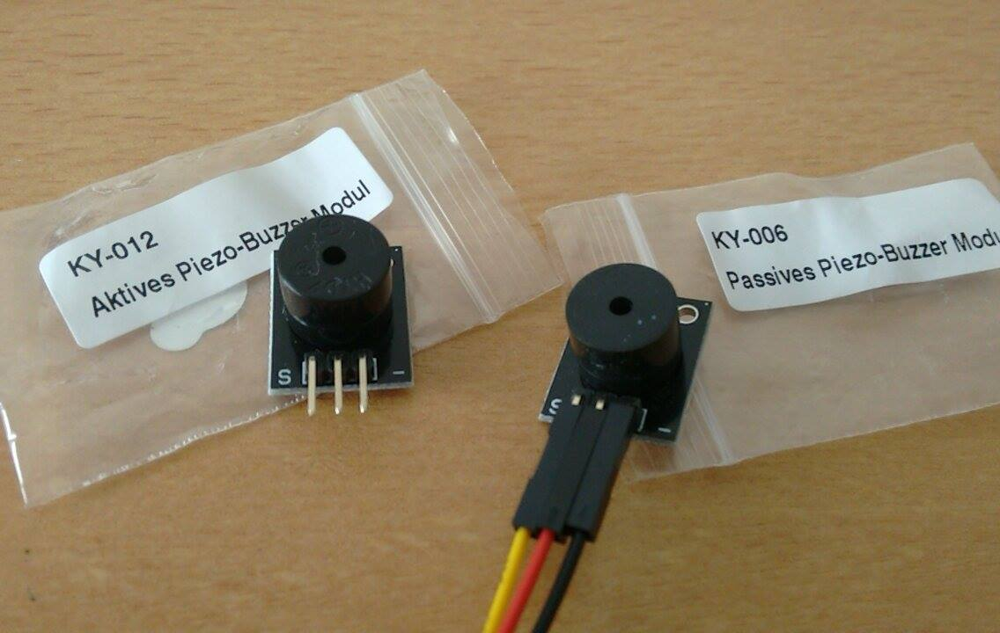

this is the manual/dumb buzzer. it's only a speaker so you need to feed it a waveform

Below we have the Active and Passive Buzzer

The passive works like the LK-buzzer, just plug the ground (black), vcc (red) and the data (yellow) cables and it will work.

The active works with the same configuration, but you will need some code modifications because it inicial state is to do noise.
