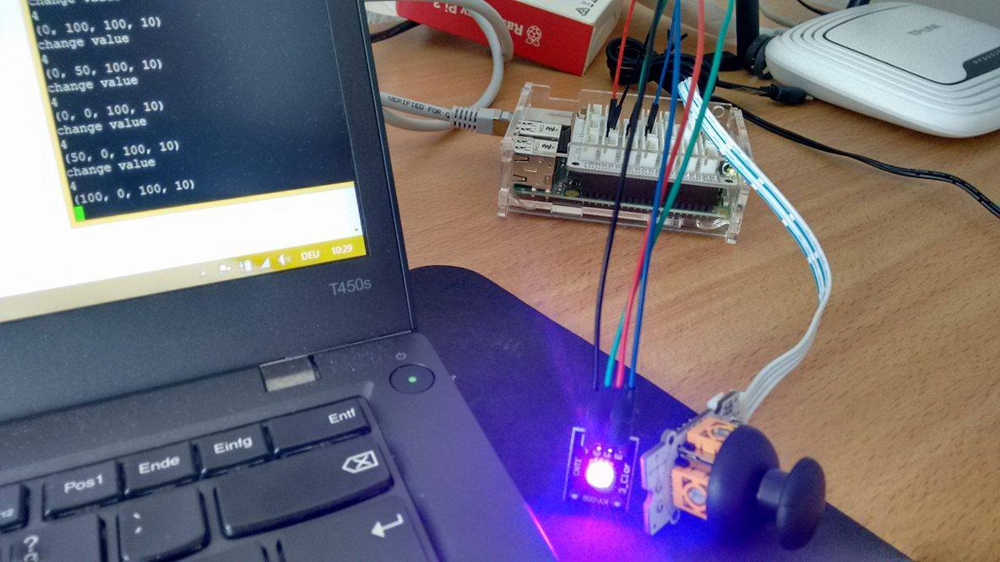
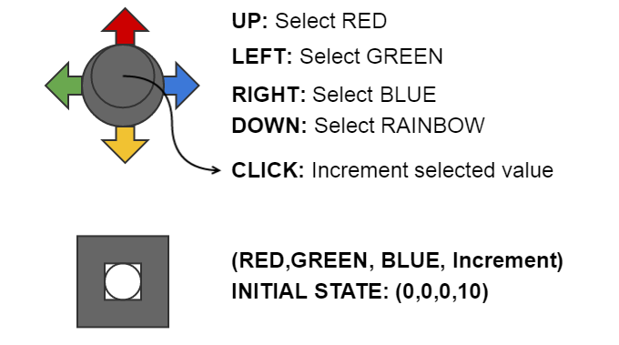

## Change RGB Led color using a joystick

Setup:
Connect the joystick in an Analog port (A0,A1) and the RGB LED (SMD) like in [here](../../actor-RGB-LED)

Run the [joy.py](joy.py) file. Do any changes as you need.

## How it works

Using the joy stick you can change the value of each channel R, G or B. First you select the channel you want to change: UP for RED, LEFT for GREEN and RIGHT for BLUE. After each click on the joystick increments the value of the channel in 10 units, in a interval between 0 to 100. By increment a 100 value it turn up in 0 again.

You can select DOWN to acces 12 default [colors](../../actor-RGB-LED#code-colors) and choose between one of them. After, if you want to change any value from the selected color, you just need to select a channel again and increment.
