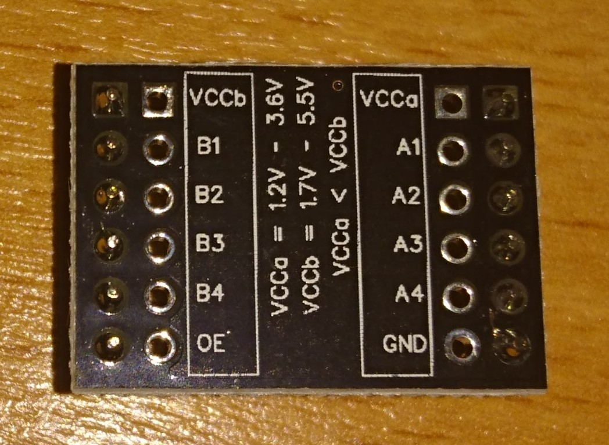

This is based on this guide:
[sensorkit.joy-it.net/index.php?title=KY-051_Voltage_Translator_/_Level_Shifter](http://sensorkit.joy-it.net/index.php?title=KY-051_Voltage_Translator_/_Level_Shifter)

This is a [Level shifter](https://en.wikipedia.org/wiki/Logic_level), not to be confused with a [Voltage Regulator](https://en.wikipedia.org/wiki/Voltage_regulator).
>"A level shifter connects one digital circuit that uses one logic level to another digital circuit that uses another logic level."

You can use the [`analogIn.py`](../analogIn.py) to test the values output.

The KY-051 follows the ratio 3,3V:5V (A:B).
You should connect a 3,3V VCC into VCCa and a 5V VCC into VCCb.

Now, for every input connected to Bx (B1-B4) that uses 5V as VCC, you will have the translated value as a 3,3V max on Ax (A1-A4).

For instance:
If we put a digital HIGH on B1, we should have a digital HIGH on A1. That means we will have 5V on B1 and 3,3V on A1, as it is translated.

The connections should be (`ky051: board`):
* VCCa 	:	V (input 3,3V)
* VCCb 	: 	V (input 5V)
* GND 	: 	G
* OE 	:	G
* A1-A4	: 	3,3V input/output
* B1-B4	:	5V output/input (the opposite of Ax for Bx)