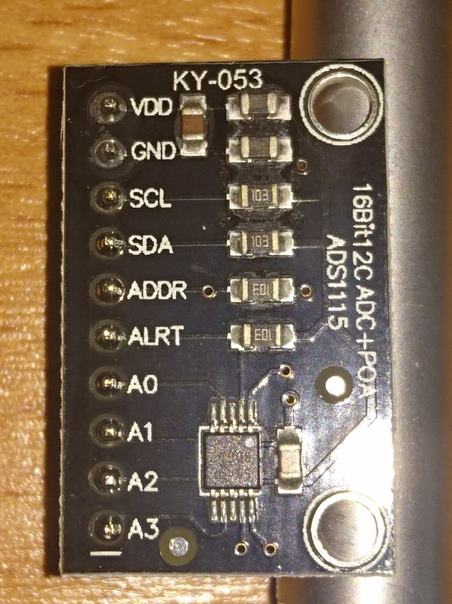

This is based on this guide:

[sensorkit.joy-it.net/index.php?title=KY-053_Analog_Digital_Converter](http://sensorkit.joy-it.net/index.php?title=KY-053_Analog_Digital_Converter)

Steps to get running:

* Open this file:
```
sudo nano /boot/config.txt
```

* Uncomment the line:
```
dtparam=i2c_arm=on
```

* Reboot

* Install
```
sudo apt-get install python-smbus i2c-tools -y
```

* Run the [example code](KY-053_RPi_AnalogDigitalConverter.py) (needs the other .py files from this folder also).
```
sudo python KY-053_RPi_AnalogDigitalConverter.py
```

The connections should be (`ky053: board`):
* VDD 	:	V 	 			[Pin 01]
* GND 	: 	G
* SCL 	: 	SCL (top left of the shield board)
* SDA 	: 	SDA (top left of the shield board)
* ADDR 	: 	No Connection 	[-]
* ALRT 	: 	No Connection 	[-]
* A0 	: 	Any Analog Input
* A1 	: 	Any Analog Input
* A2 	: 	Any Analog Input
* A3 	: 	Any Analog Input