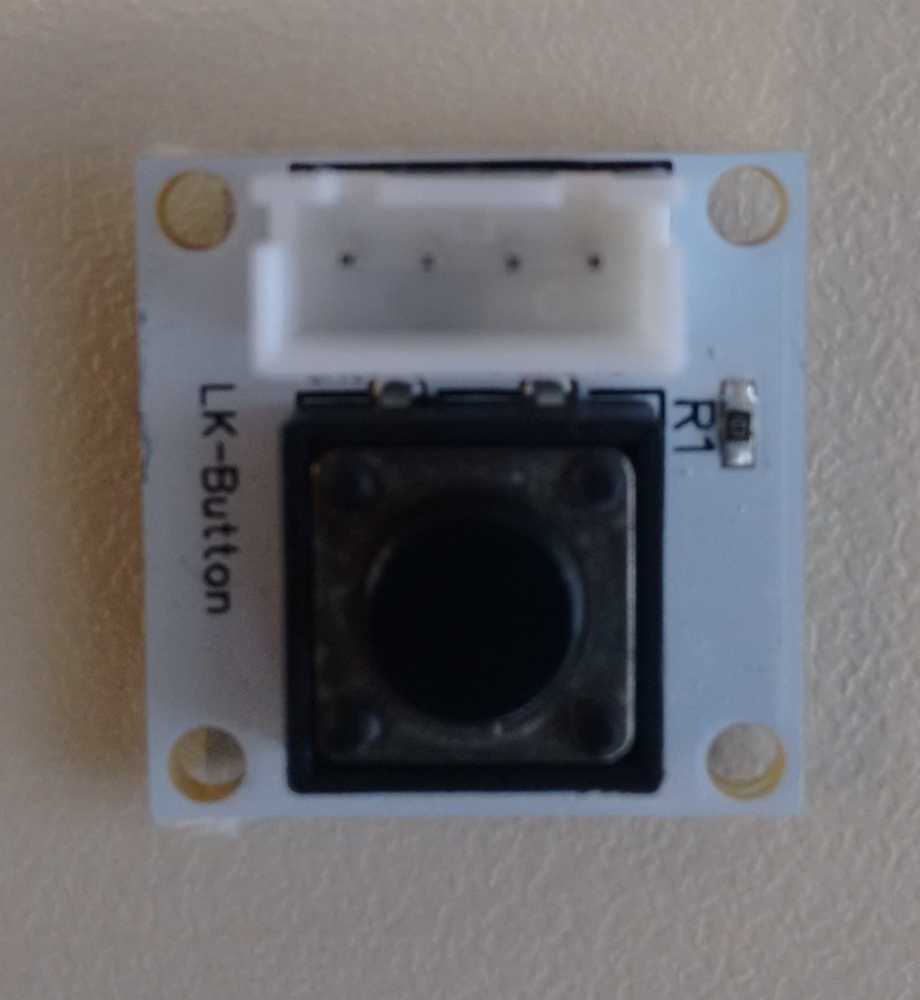
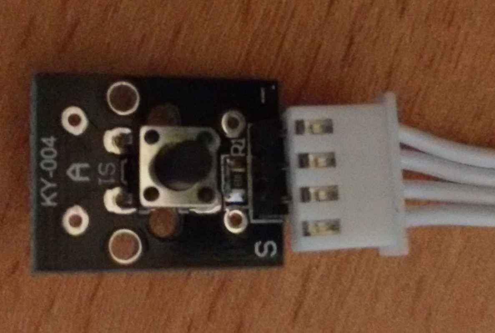
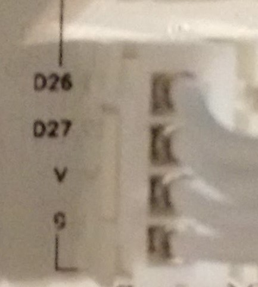

This contains info about several buttons:
* [linksprite button (dual)](#linksprite-button)
* [LK button (single)](#lk-button)
* [KY-004 Taster-Modul (single)](#ky004-taster-modul)

## Linksprite Button

Code example [here](button.py).

## LK Button

Code example [here](lk-button.py).

## KY-004 Taster-Modul

This button can use the [same code](lk-button.py) as the LK button.
This button has only 3 pins:

The pins should match for the extension board connection:
* - to G (sensor to board)
* middle pin to V (sensor to board)
* S to D27 - or any D pin you want to use, modifying the number used on the code (sensor to board)