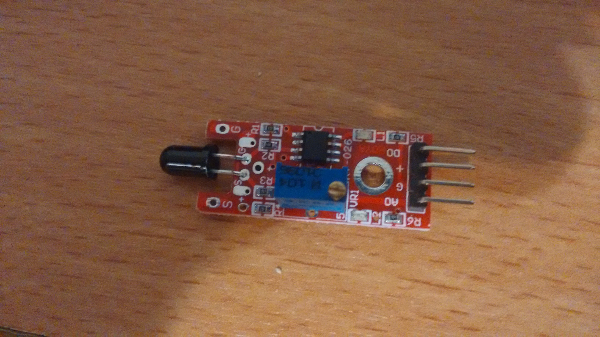

## Sensor KY-026: Flame sensor

The *pins need to be remaped* for the extension board, where (`sensor: board`) - following the [example code](flame.py):
* A0:	D16
* G:	G
* +:	V
* D0:	D15

* A0 – inverted signal
* G – should be connected to ground
* + – should be connected to 5V power supply
* D0 – flame signal
