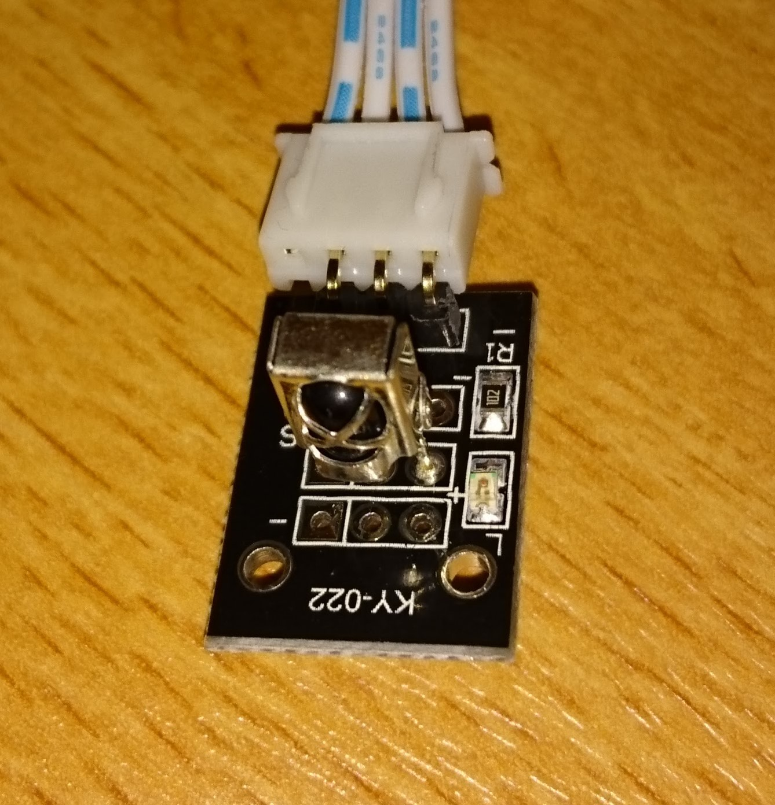

## Sensor KY-005: Infrared Receiver

This sensor was tested together with the [actor infrared transmitter](../actor-infrared-transmitter).

The pins for the extension board, where (`sensor: board`) - following the [example code](infrared-recv.py):
* -:	G
* (middle pin):	V
* S:	D27
