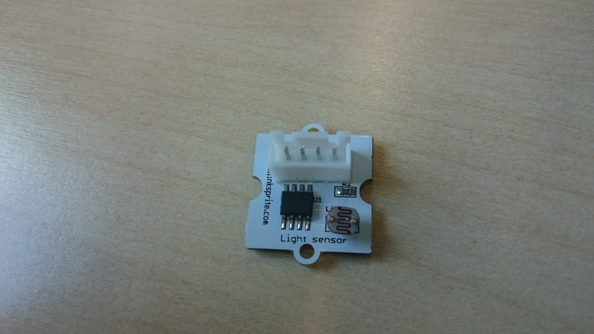

The linksprite board has a 4-channel analog-to-digital converter. You need to use this to read values from analog sensors since the RaspberryPi doesn't have analog inputs.

*Note* that the board has a jumper to set VCC to 3.3V or 5V. Some devices will not work if it's the wrong setting...

* `analogIn.py` shows how to read the values
* `analogInputDemo` display all 4 values in real time; useful for test/debug 

### Sensors include
* temperature
* light
* noise level
* 3-axis accelerometer

For the temperature sensor, use this python code to convert raw values to degrees celsius:

    temp = (((value * 1000) - 500)/10)

