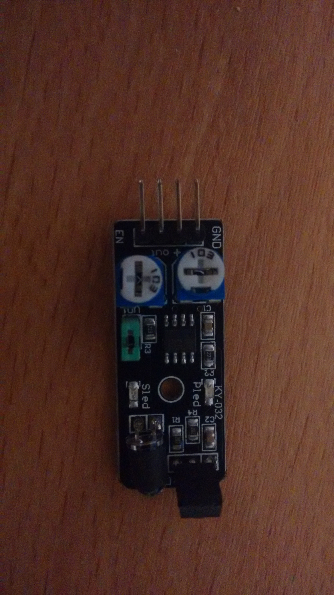
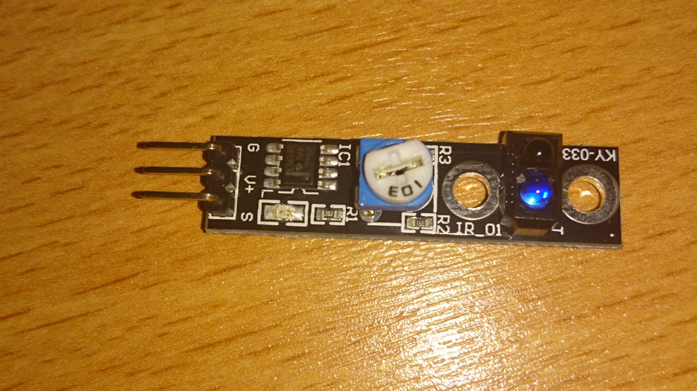

This contains info about:
* [Sensor KY-032: Obstacle avoidance sensor](#sensor-ky-032)
* [Sensor KY-033: Tracking sensor](#sensor-ky-033)

## Sensor KY-032

The *pins need to be remaped* for the extension board, where (`sensor: board`) - following the [example code](obstacle.py):
* GND:	G
* +:	V
* out:	D15
* EN:	D16

Pins:
* GND – should be connected to ground
* + – should be connected to 5V power supply
* out – obstacle signal
* EN – no use found

## Sensor KY-033

Theoretically this is made for tracking lines, though, through tests, it detects any close object (obstacle detection).

Calibrate it through the potentiometer. It may make a great difference on results.

**Works best in the dark.**

The pin connection for the extension board, where (`sensor: board`) - following the [example code](tracking.py):
* S:	D27
* (middle pin):	V
* -:	G
