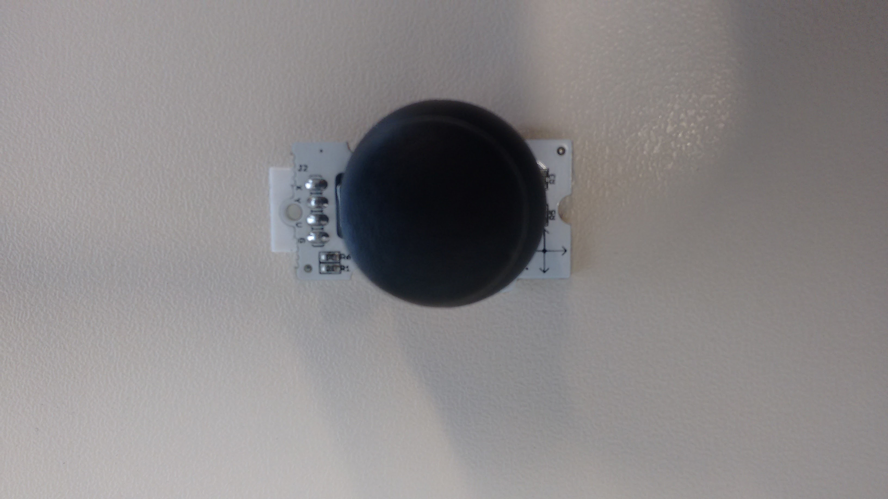
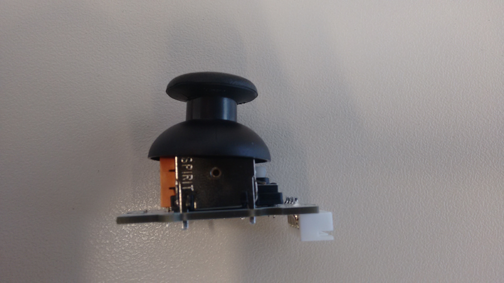
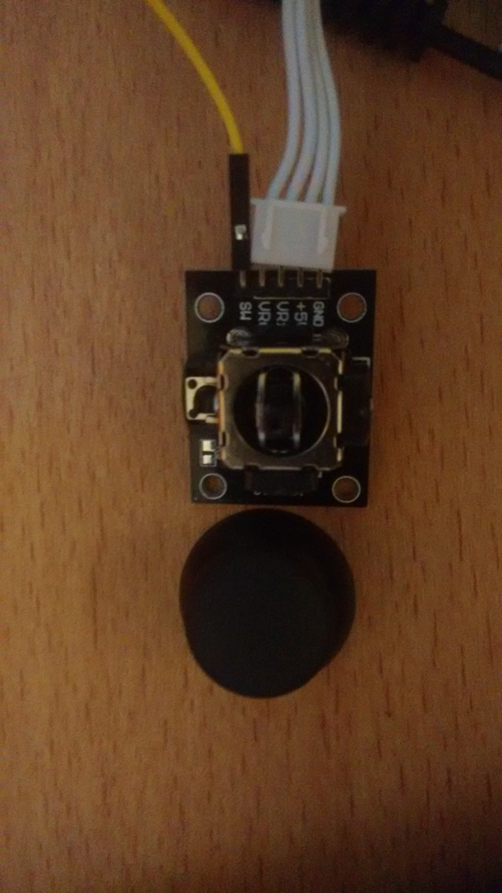
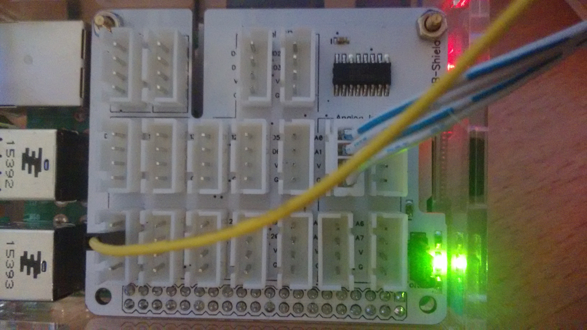

* [Linksprite Thumb Joystick](linksprite-thumb-joystick)

* [KY-023 Joystick Modul](ky-023-joystick)

## Linksprite Thumb Joystick

[Example code](thumbjoystick.py).

## KY-023 Joystick

[Example code](ky023.py) (very similar to the linksprite one - only the switch has an additional pin).
This sensor has 5 pins, each one specified on the hardware itself.
For the example code, the pins are (`sensor: extension board`):
* x:	A0
* y:	A1
* sw:	D27 (notice the yellow cable on the images below)
* +5V:	V
* GND:	G

