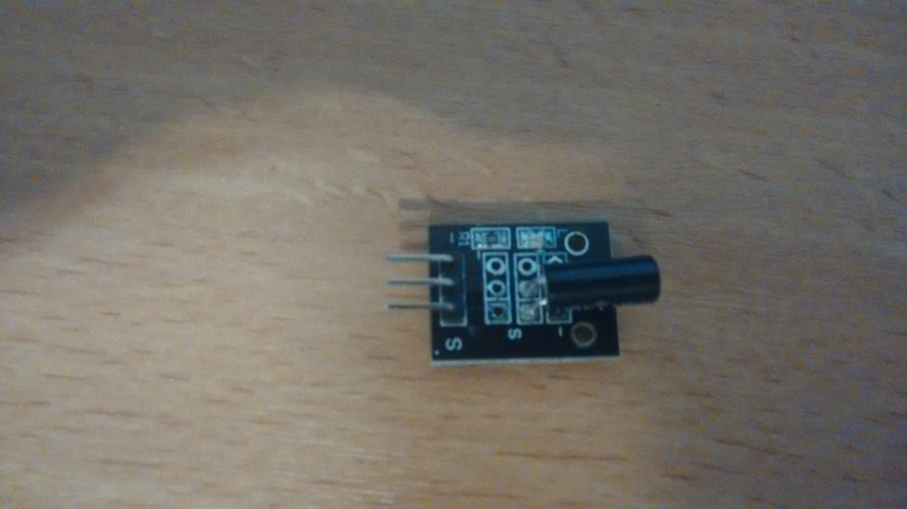

## Sensor KY-017 and KY-020: Tilt switch sensor

Valid for both sensors:
The pins for the extension board, where (`sensor: board`) - following the [example code](tilt.py):
* -:	G
* (middle pin):	V
* S:	D15
