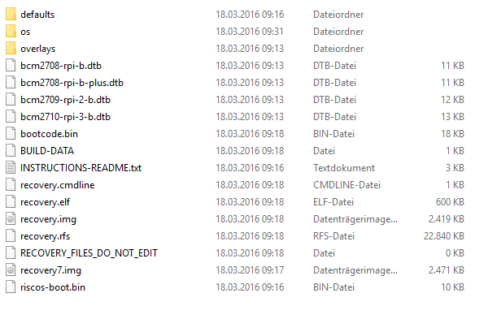
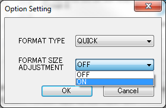
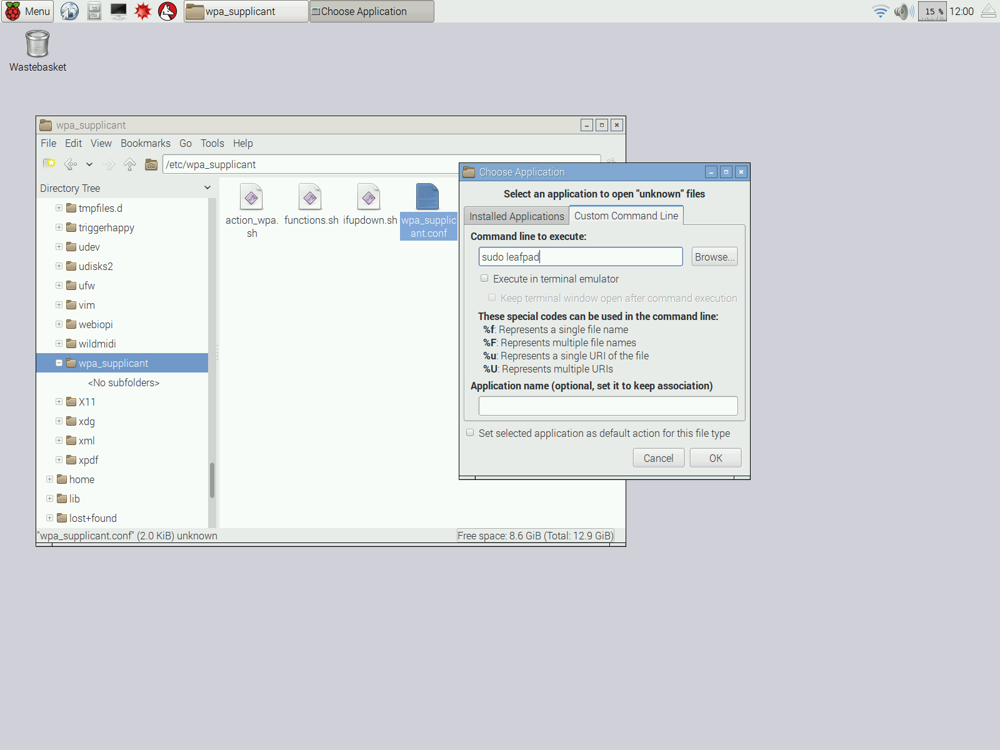

# List of contents
* [Raspbian (OS) install](#install)
* [Updates](#update)
* [SPI enable](#spi-enable)
* [SSH Access](#ssh-access)
* [SD card reset](#sd-card-reset)
* [SO issue solving](#issue-solving)
* [Eduroam wlan config](#eduroam)
* [VPN IPVS](#vpn-ipvs)

## Install

This guide is also found [here](https://www.raspberrypi.org/documentation/installation/noobs.md).
* [Download NOOBS offline and network install](https://www.raspberrypi.org/downloads/noobs/)
* Format a microSD (at least 4GB) on **FAT32**
* Unzip the content of the downloaded file on the card. The card content should look like:

* Plug the card and plug the power on the Raspberry (in that order)
* When the loading is complete, select the *Raspbian* option and click on Install

* Wait until the installation is finished and the OS is ready

## Update

### SO Update
* Open the terminal (`ctrl + alt + T`)
* Do the following commands (type `y` for the incoming questions after each command):
 * `sudo apt-get update`
 * `sudo apt-get dist-upgrade`
 
### Firmware Update
* Open the terminal (`ctrl + alt + T`)
* Do the following commands (type `y` for the incoming questions after each command):
 * `sudo rpi-update`
 * `reboot`

## SPI Enable
This guide is also found [here](http://www.raspberrypi-spy.co.uk/2014/08/enabling-the-spi-interface-on-the-raspberry-pi/).
* Run `sudo raspi-config` on the terminal
* Navigate to `9 Advanced Options`
* Navigate to `A5 SPI`
* Select `Enable`
* Select `Yes` when asked about the kernel module
* Select `Yes` when asked to reboot the system
You can check if it's enable through the command on the terminal:
`lsmod | grep spi_`
You should see “spi_bcm2708″ or “spi_bcm2835”
To check if the library is available for python:
`apt-mark showauto | grep spi`
You should see the two python spidev packages listed in the output.

## SSH Access

This guide is also found [here](https://www.raspberrypi.org/documentation/remote-access/ssh/).
SSH is already enabled on RaspberryPi by default.
To access, you will need to check the RaspberryPi IP. That can be done through the terminal with on of the following commands (`eth0` stands for your ethernet interface IP and`wlan0` for your wireless interface IP):
* `sudo ifconfig -a`
* `sudo ip addr show`
* `sudo hostname --ip-address`
The default *username* is `pi` and the default *password* is `raspberry`.
If the SSH is **not enabled**, you can enable through:
* Run `sudo raspi-config` on the terminal
* Navigate to `9 Advanced Options`
* Navigate to `A4 SSH`
* Select `Enable`

## SD card reset

This guide is also found [here](http://kb.sandisk.com/app/answers/detail/a_id/14827/~/using-sd-formatter-tool-to-restore-full-capacity-on-sdhc%2Fsdxc-cards).
* [Download SD Formatter Tool](https://www.sdcard.org/downloads/formatter_4/) (scroll to the bottom of the page)
* Install the application
* With the SD card plugged, open the application
* Go to *Option*, change *FORMAT SIZE ADJUSTMENT* to *ON*

* Click on *Format*

## Issue Solving

### Display resolution problem

This resolution is also found [here](http://weblogs.asp.net/bleroy/getting-your-raspberry-pi-to-output-the-right-resolution).
* Open the terminal (`ctrl + alt + T`)
* Do the following commands (type `y` for the incoming questions after each command):
 * `tvservice -d edid`
 * `edidparser edid`
* Edit the file `/boot/config.txt`
 * `nano /boot/config.txt`
* Uncomment the following lines and put those values (If your mode description from the last command contains “DMT”, the group should be 2, and if it contains “CEA”, it should be 1):
  * `hdmi_group=2`
  * `hdmi_mode=82`

## Eduroam
This resolution is based on this [link](http://www.willprice.org/2014/03/17/eduroam-on-the-raspberry-pi.html)
* Open the terminal (`ctrl + alt + T`)
* Do the following command to stop the network on Raspberry: 
 * `sudo service networking stop`
* Now acces the file `wpa_supplicant.conf` as administrator: 
 * You can open it on terminal with the command `sudo leafpad /etc/wpa_supplicant/wpa_supplicant.conf`
 * Or you go to the folder `/etc/wpa_supplicant/`, right click on `wpa_supplicant.conf` and choose `Open With`. Change the tab from `Installed Applications` to `Custom Command Line` and write `sudo leafpad`:
  
    

* Then you will find the reference to the eduroam network and change it to :
  * 
   `network={
    identity="ab1234"
    password="myUOBpassword"
    ca_cert="/etc/ssl/certs/Deutsche_Telekom_Root_CA_2.pem"
    eap=PEAP TTLS
    anonymous_identity="@"
    phase1="peaplabel=0"
    phase2="auth=MSCHAPV2"
    priority=999
    disabled=0
    ssid="eduroam"
    scan_ssid=0
    mode=0
    auth_alg=OPEN
    proto=WPA RSN
    pairwise=CCMP TKIP
    key_mgmt=WPA-EAP
    proactive_key_caching=1
}`
* Change your identity and password and save the file.
* After, run `sudo wpa_supplicant -i wlan0 -c /etc/wpa_supplicant/wpa_supplicant.conf -B`
* Your connection should work!
 
## VPN IPVS
* [Download Cisco AnyConnect Secure Mobility Client](http://www.cisco.com/c/en/us/support/security/anyconnect-secure-mobility-client/tsd-products-support-series-home.html)
* Install and connect to: `asa1.informatik.uni-stuttgart.de`
* Use your IPVS username/password
